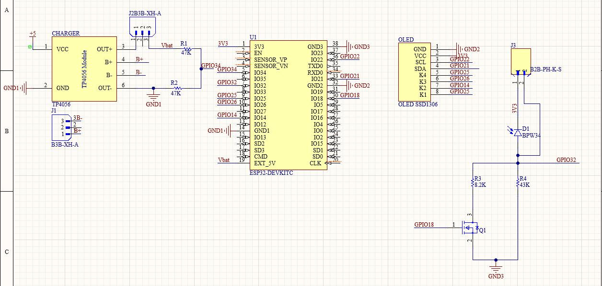

# 🔦 Portable Optical Power Meter

A compact, portable optical power meter built from the ground up during an internship at **Lasertex sp. z o.o.**

The device measures photodiode current using an ESP32 microcontroller, displays real-time optical power on an SSD1306 OLED display, and features a MOSFET-based auto-ranging circuit for extended dynamic range. It was validated against a laboratory-grade **Thorlabs PM100D** reference meter.

---

## 📷 Hardware

| Schematic | Calibration Chart |
|:---------:|:-----------------:|
|  |  |

---

## ✨ Features

- **Auto-ranging** — MOSFET-switched shunt resistors (43 kΩ / ~6.9 kΩ) extend the measurable dynamic range automatically
- **Wavelength selection** — On-device menu to select laser wavelength (450 nm / 520 nm / 650 nm) and apply the correct photodiode responsivity
- **Real-time display** — Power readout on 128×64 SSD1306 OLED in large centred text (µW)
- **ADC averaging** — 32-sample averaging with ESP-IDF calibration for improved accuracy
- **4-button UI** — UP / DOWN / MENU / OK buttons for wavelength selection without a PC

---

## 🛠️ Technologies

| Area | Tools / Skills |
|------|---------------|
| PCB Design | Altium Designer |
| Firmware | Embedded C (ESP-IDF v5.4.x) |
| Microcontroller | ESP32 DevKit-C V4 |
| Display | SSD1306 (I²C, 128×64 OLED) |
| Analog Design | MOSFET auto-ranging, transimpedance-style measurement |
| Calibration | Validated against Thorlabs PM100D |

---

## 📁 Project Structure

```
├── main/
│   ├── main.c          # ESP32 firmware (ADC, OLED, auto-ranging, UI)
│   ├── font6x8.h       # 6×8 pixel ASCII font for OLED rendering
│   └── CMakeLists.txt
├── CMakeLists.txt      # ESP-IDF top-level project file
├── sdkconfig           # ESP-IDF board/peripheral configuration
├── Shematic.jpeg       # Full circuit schematic
└── Chart.jfif          # Calibration chart (vs. Thorlabs PM100D)
```

---

## ⚙️ Building & Flashing

This project uses the **ESP-IDF** build system. Make sure ESP-IDF v5.x is installed and sourced.

```bash
# Configure (optional — sdkconfig is already committed)
idf.py menuconfig

# Build
idf.py build

# Flash to ESP32
idf.py -p COM<PORT> flash monitor
```

> **Note:** Enable the legacy ADC driver in `menuconfig` → Component Config → Driver Configurations.

---

## 🔌 Hardware Connections

| Signal | ESP32 GPIO |
|--------|-----------|
| OLED SDA (I²C) | GPIO 21 |
| OLED SCL (I²C) | GPIO 22 |
| Photodiode ADC | GPIO 32 (ADC1_CH4) |
| MOSFET gate (range) | GPIO 18 |
| Button UP (K1) | GPIO 25 |
| Button DOWN (K2) | GPIO 26 |
| Button MENU (K3) | GPIO 14 |
| Button OK/ESC (K4) | GPIO 27 |

---

## 📐 Auto-Ranging Logic

Two shunt resistors set the measurement range:
- **High range** (MOSFET off): 43 kΩ → lower currents / weaker light
- **Low range** (MOSFET on): 43 kΩ ∥ 8.2 kΩ ≈ 6.9 kΩ → higher currents / stronger light

The firmware automatically switches range when the ADC reading crosses upper (3300) or lower (500) thresholds.

---

## 🙌 Acknowledgements

Designed and built at **Lasertex sp. z o.o.** during an engineering internship.
